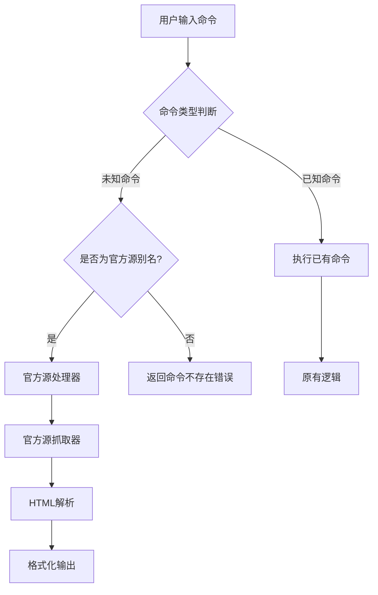
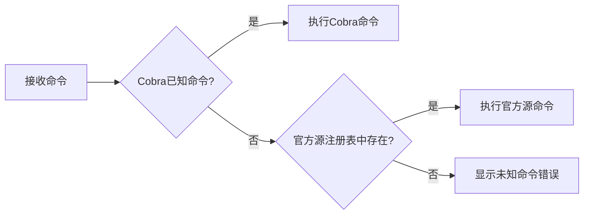
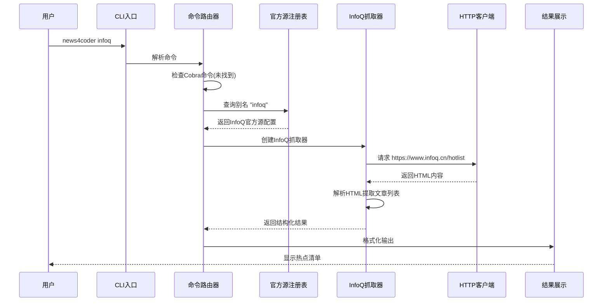

# 官方新闻源模式设计文档

## 功能概述

为 News4Coder 新增官方新闻源模式,允许用户直接通过别名快捷访问预置的官方新闻源,无需手动执行 fetch 命令。首个官方源为 InfoQ 中文站热点清单。

## 核心目标

- 提供开箱即用的官方新闻源,降低使用门槛
- 支持别名快捷访问,简化命令输入
- 直接抓取官方页面内容,避免搜索引擎限制
- 保持架构可扩展,便于后续添加更多官方源

## 业务价值

- **用户体验提升**: 用户无需先 add 订阅再 fetch,直接输入别名即可获取内容
- **稳定性增强**: 直接抓取官方页面,不依赖 DuckDuckGo 搜索,避免反爬虫限制
- **快速上手**: 新用户可立即体验工具核心功能,无需配置

## 功能需求

### 使用场景

用户可通过以下方式访问官方新闻源:

```
news4coder infoq
```

直接输出 InfoQ 热点清单内容,无需提前添加订阅或输入完整的 fetch 命令。

### 官方新闻源定义

官方新闻源是预置在系统中的特殊订阅源,具有以下特征:

- **预置配置**: 在代码中硬编码,无需用户添加
- **专属别名**: 每个官方源拥有唯一的短别名
- **直接抓取**: 使用专门的抓取逻辑,而非通用搜索引擎
- **优先级**: 当别名与用户自定义订阅冲突时,官方源优先

### 首个官方源: InfoQ 中文站

| 属性 | 值 |
|------|-----|
| 名称 | InfoQ 中文站热点清单 |
| 别名 | infoq |
| 目标 URL | https://www.infoq.cn/hotlist |
| 内容类型 | 热点文章列表 |
| 抓取方式 | 直接解析 HTML 页面 |

## 系统设计

### 架构调整



### 模块职责

#### 官方源注册表 (Official Source Registry)

负责管理所有官方新闻源的元数据和抓取策略。

**职责**:
- 维护官方源列表(名称、别名、URL、抓取策略)
- 提供根据别名查找官方源的能力
- 支持官方源的注册和扩展

**数据结构**:

| 字段 | 类型 | 说明 |
|------|------|------|
| Alias | 字符串 | 官方源别名,如 "infoq" |
| Name | 字符串 | 官方源名称,如 "InfoQ 中文站热点清单" |
| URL | 字符串 | 目标页面 URL |
| FetcherType | 枚举 | 抓取器类型标识 |
| Description | 字符串 | 官方源描述信息 |

#### 官方源抓取器 (Official Fetcher)

针对特定官方源实现的内容抓取逻辑。

**职责**:
- 发起 HTTP 请求获取页面内容
- 解析 HTML 提取结构化数据
- 处理抓取异常和降级策略
- 返回统一格式的结果

**InfoQ 抓取器设计**:

目标页面: https://www.infoq.cn/hotlist

需要提取的信息:
- 文章标题
- 文章链接
- 文章摘要(如有)
- 排序序号

异常处理策略:
- 网络请求失败: 提示用户检查网络并提供页面直接访问链接
- HTML 解析失败: 提示页面结构可能变更,建议访问原页面
- 未找到内容: 提示可能页面结构已调整

#### 命令路由增强 (Command Router Enhancement)

扩展 Cobra 命令框架,支持动态命令识别。

**职责**:
- 拦截未知命令
- 判断是否为官方源别名
- 路由到官方源处理器
- 保持原有命令优先级

**路由逻辑**:



### 交互流程



### 数据模型

#### 官方源配置模型

| 字段 | 类型 | 必填 | 说明 |
|------|------|------|------|
| alias | string | 是 | 唯一别名,用于命令行调用 |
| name | string | 是 | 官方源显示名称 |
| url | string | 是 | 目标页面完整URL |
| fetcher_type | string | 是 | 抓取器类型标识 |
| description | string | 否 | 官方源简介 |
| enabled | boolean | 是 | 是否启用,默认 true |

#### 抓取结果模型

复用现有的 SearchResult 模型,保持输出一致性:

| 字段 | 类型 | 说明 |
|------|------|------|
| Index | int | 序号 |
| Title | string | 文章标题 |
| URL | string | 文章链接 |
| Snippet | string | 文章摘要 |

### 容错与降级策略

基于项目中的容错处理规范,官方源抓取需要实现以下策略:

#### HTML 解析容错

- **多选择器策略**: 为关键内容准备备选 CSS 选择器,当主选择器失效时自动切换
- **部分失败容忍**: 允许部分文章解析失败,只要成功获取至少 3 条内容即视为成功
- **结构变更检测**: 当解析结果为空时,记录警告日志并提示用户页面可能已更新

#### 网络请求容错

- **超时设置**: HTTP 请求设置 15 秒超时,避免长时间等待
- **重试机制**: 网络临时故障时自动重试 1 次,间隔 2 秒
- **User-Agent 模拟**: 设置真实浏览器 User-Agent,降低被拦截风险

#### 降级方案

当抓取完全失败时,提供以下降级选项:

| 失败类型 | 降级策略 |
|----------|----------|
| 网络不可达 | 提示检查网络连接,并显示页面直接访问链接 |
| 页面结构变更 | 提示访问原页面,并建议更新工具版本 |
| 内容为空 | 提示可能页面暂无内容或结构调整 |

### 可扩展性设计

为便于后续添加更多官方源,设计需要支持:

#### 抓取器注册机制

每个官方源对应一个独立的抓取器实现,通过工厂模式动态创建:

- 定义抓取器接口,规范 Fetch 方法签名
- 实现抓取器工厂,根据 fetcher_type 创建对应实例
- 新增官方源时,只需实现抓取器接口并注册到工厂

#### 官方源配置化

将官方源列表集中管理,新增源时只需添加配置项:

- 所有官方源配置位于统一位置
- 配置包含别名、名称、URL、抓取器类型等元数据
- 支持通过配置启用/禁用特定官方源

#### 命令帮助集成

自动将官方源列表集成到帮助信息:

- 在 `news4coder --help` 中展示可用官方源列表
- 新增 `news4coder sources` 命令列出所有官方源
- 每个官方源支持独立的帮助说明

### 用户交互设计

#### 成功场景输出

当用户执行 `news4coder infoq` 时,输出格式应与现有 fetch 命令保持一致:

```
⟳ 正在获取 InfoQ 中文站热点清单 的最新内容...

━━━ InfoQ 中文站热点清单 最新内容 ━━━

1. 文章标题一
   🔗 https://www.infoq.cn/article/xxx
   文章摘要内容...

2. 文章标题二
   🔗 https://www.infoq.cn/article/yyy
   文章摘要内容...

...

━━━ 共 10 条结果 ━━━

💡 提示: 内容来自 InfoQ 官方热点清单
```

#### 错误场景提示

**网络错误**:
```
❌ 获取内容失败: 网络连接超时

建议:
1. 检查网络连接
2. 直接访问: https://www.infoq.cn/hotlist
```

**解析错误**:
```
❌ 内容解析失败: 页面结构可能已变更

建议:
1. 访问原页面: https://www.infoq.cn/hotlist
2. 检查工具更新: news4coder version
```

#### 帮助信息增强

在根命令帮助中添加官方源说明:

```
可用的命令:
  add         添加订阅
  fetch       获取订阅内容
  list        列出订阅
  remove      删除订阅
  sources     列出所有官方新闻源
  help        帮助信息

官方新闻源快捷访问:
  infoq       InfoQ 中文站热点清单

使用 "news4coder [command] --help" 获取更多信息
```

新增 sources 命令输出:

```
━━━ 官方新闻源列表 ━━━

别名     名称                         URL
────────────────────────────────────────────────────────
infoq    InfoQ 中文站热点清单          https://www.infoq.cn/hotlist

使用方法: news4coder <别名>
示例: news4coder infoq
```

## 实现要点

### 模块划分

| 模块路径 | 职责 | 关键组件 |
|----------|------|----------|
| internal/official/registry.go | 官方源注册表 | 官方源列表、查询方法 |
| internal/official/fetcher.go | 抓取器接口定义 | Fetcher 接口、工厂方法 |
| internal/official/infoq_fetcher.go | InfoQ 抓取器实现 | HTML 解析、结果提取 |
| cmd/official.go | 官方源命令处理 | 命令路由、结果展示 |
| cmd/sources.go | 官方源列表命令 | 展示所有官方源 |

### 命令路由实现策略

由于 Cobra 框架默认不支持动态命令,需要采用以下策略:

**方案**: 利用 Cobra 的 Unknown Command 钩子

在 root.go 中设置未知命令处理器,拦截所有未匹配的命令并检查是否为官方源别名。如果是,则执行官方源逻辑;否则返回标准的未知命令错误。

**流程**:
1. 用户输入 `news4coder infoq`
2. Cobra 解析命令,未找到 infoq 子命令
3. 触发未知命令处理器
4. 处理器查询官方源注册表
5. 找到 infoq 配置,执行官方源抓取逻辑

### InfoQ 页面抓取策略

**目标页面**: https://www.infoq.cn/hotlist

**抓取步骤**:
1. 发送 HTTP GET 请求,设置浏览器 User-Agent
2. 使用 goquery 解析 HTML 文档
3. 定位文章列表容器(需实际分析页面结构确定选择器)
4. 遍历文章项,提取标题、链接、摘要
5. 限制结果数量为 10 条
6. 封装为 SearchResult 列表返回

**HTML 选择器设计考虑**:
- 主选择器: 根据实际页面结构确定
- 备选选择器: 准备 2-3 个备选方案
- 容错处理: 当主选择器返回空结果时自动尝试备选

**注意事项**:
- InfoQ 可能使用动态渲染(JavaScript),需确认内容是否在初始 HTML 中
- 如使用 JavaScript 渲染,可能需要调整抓取策略或选择其他页面
- 定期验证页面结构,确保选择器有效性

### 与现有系统集成

**复用现有组件**:
- 复用 SearchResult 模型,保持输出格式一致
- 复用 displayResults 函数,统一展示逻辑
- 复用 HTTP 客户端配置(超时、User-Agent 等)

**隔离新增逻辑**:
- 官方源相关代码独立于订阅管理模块
- 不修改现有 fetch、add、list、remove 命令逻辑
- 新增功能与原有功能解耦,避免相互影响

### 配置与维护

**官方源配置位置**: 代码内硬编码,不存储在用户配置文件中

**版本管理**:
- 官方源列表随工具版本发布
- 页面结构变更时需发布新版本更新抓取逻辑
- 建议在 README 中说明官方源维护策略

**监控与反馈**:
- 抓取失败时记录详细错误信息
- 建议用户通过 Issue 反馈页面结构变更
- 提供调试模式输出原始 HTML(通过环境变量控制)

## 非功能需求

### 性能要求

- HTTP 请求响应时间: 不超过 15 秒
- HTML 解析耗时: 不超过 2 秒
- 总体命令执行时间: 不超过 20 秒

### 稳定性要求

- 网络故障时提供清晰错误提示,不崩溃
- HTML 结构变化时部分降级,不影响其他功能
- 官方源抓取失败不影响用户自定义订阅的使用

### 可维护性要求

- 新增官方源仅需添加配置和抓取器实现,无需修改核心逻辑
- 抓取器接口清晰,易于理解和扩展
- 代码注释说明 HTML 选择器含义和可能的变更点

## 风险与应对

| 风险 | 影响 | 应对措施 |
|------|------|----------|
| InfoQ 页面结构频繁变更 | 抓取失败,功能不可用 | 提供多个备选选择器;引导用户访问原页面;定期检查更新 |
| 页面使用 JavaScript 动态渲染 | 初始 HTML 无内容,抓取失败 | 分析页面确认;必要时调整目标页面或引入 headless 浏览器 |
| 官方源别名与用户自定义订阅冲突 | 命令歧义 | 官方源优先或提示用户修改订阅别名 |
| 网络请求被反爬机制拦截 | 请求失败或需验证 | 设置合理 User-Agent;降低请求频率;提供降级访问方式 |

## 后续扩展方向

### 更多官方源

优先级候选:
- Hacker News 首页
- V2EX 最热
- GitHub Trending
- 掘金热榜

### 官方源配置外部化

将官方源配置移至独立文件(如 YAML),支持用户自定义或禁用官方源。

### 缓存机制

对官方源内容进行本地缓存,避免频繁请求,提升响应速度。

### 自动更新检测

定期检查官方源页面结构是否变更,主动提醒用户更新工具版本。

#### 抓取器注册机制

每个官方源对应一个独立的抓取器实现,通过工厂模式动态创建:

- 定义抓取器接口,规范 Fetch 方法签名
- 实现抓取器工厂,根据 fetcher_type 创建对应实例
- 新增官方源时,只需实现抓取器接口并注册到工厂

#### 官方源配置化

将官方源列表集中管理,新增源时只需添加配置项:

- 所有官方源配置位于统一位置
- 配置包含别名、名称、URL、抓取器类型等元数据
- 支持通过配置启用/禁用特定官方源

#### 命令帮助集成

自动将官方源列表集成到帮助信息:

- 在 `news4coder --help` 中展示可用官方源列表
- 新增 `news4coder sources` 命令列出所有官方源
- 每个官方源支持独立的帮助说明

### 用户交互设计

#### 成功场景输出

当用户执行 `news4coder infoq` 时,输出格式应与现有 fetch 命令保持一致:

```
⟳ 正在获取 InfoQ 中文站热点清单 的最新内容...

━━━ InfoQ 中文站热点清单 最新内容 ━━━

1. 文章标题一
   🔗 https://www.infoq.cn/article/xxx
   文章摘要内容...

2. 文章标题二
   🔗 https://www.infoq.cn/article/yyy
   文章摘要内容...

...

━━━ 共 10 条结果 ━━━

💡 提示: 内容来自 InfoQ 官方热点清单
```

#### 错误场景提示

**网络错误**:
```
❌ 获取内容失败: 网络连接超时

建议:
1. 检查网络连接
2. 直接访问: https://www.infoq.cn/hotlist
```

**解析错误**:
```
❌ 内容解析失败: 页面结构可能已变更

建议:
1. 访问原页面: https://www.infoq.cn/hotlist
2. 检查工具更新: news4coder version
```

#### 帮助信息增强

在根命令帮助中添加官方源说明:

```
可用的命令:
  add         添加订阅
  fetch       获取订阅内容
  list        列出订阅
  remove      删除订阅
  sources     列出所有官方新闻源
  help        帮助信息

官方新闻源快捷访问:
  infoq       InfoQ 中文站热点清单

使用 "news4coder [command] --help" 获取更多信息
```

新增 sources 命令输出:

```
━━━ 官方新闻源列表 ━━━

别名     名称                         URL
────────────────────────────────────────────────────────
infoq    InfoQ 中文站热点清单          https://www.infoq.cn/hotlist

使用方法: news4coder <别名>
示例: news4coder infoq
```

## 实现要点

### 模块划分

| 模块路径 | 职责 | 关键组件 |
|----------|------|----------|
| internal/official/registry.go | 官方源注册表 | 官方源列表、查询方法 |
| internal/official/fetcher.go | 抓取器接口定义 | Fetcher 接口、工厂方法 |
| internal/official/infoq_fetcher.go | InfoQ 抓取器实现 | HTML 解析、结果提取 |
| cmd/official.go | 官方源命令处理 | 命令路由、结果展示 |
| cmd/sources.go | 官方源列表命令 | 展示所有官方源 |

### 命令路由实现策略

由于 Cobra 框架默认不支持动态命令,需要采用以下策略:

**方案**: 利用 Cobra 的 Unknown Command 钩子

在 root.go 中设置未知命令处理器,拦截所有未匹配的命令并检查是否为官方源别名。如果是,则执行官方源逻辑;否则返回标准的未知命令错误。

**流程**:
1. 用户输入 `news4coder infoq`
2. Cobra 解析命令,未找到 infoq 子命令
3. 触发未知命令处理器
4. 处理器查询官方源注册表
5. 找到 infoq 配置,执行官方源抓取逻辑

### InfoQ 页面抓取策略

**目标页面**: https://www.infoq.cn/hotlist

**抓取步骤**:
1. 发送 HTTP GET 请求,设置浏览器 User-Agent
2. 使用 goquery 解析 HTML 文档
3. 定位文章列表容器(需实际分析页面结构确定选择器)
4. 遍历文章项,提取标题、链接、摘要
5. 限制结果数量为 10 条
6. 封装为 SearchResult 列表返回

**HTML 选择器设计考虑**:
- 主选择器: 根据实际页面结构确定
- 备选选择器: 准备 2-3 个备选方案
- 容错处理: 当主选择器返回空结果时自动尝试备选

**注意事项**:
- InfoQ 可能使用动态渲染(JavaScript),需确认内容是否在初始 HTML 中
- 如使用 JavaScript 渲染,可能需要调整抓取策略或选择其他页面
- 定期验证页面结构,确保选择器有效性

### 与现有系统集成

**复用现有组件**:
- 复用 SearchResult 模型,保持输出格式一致
- 复用 displayResults 函数,统一展示逻辑
- 复用 HTTP 客户端配置(超时、User-Agent 等)

**隔离新增逻辑**:
- 官方源相关代码独立于订阅管理模块
- 不修改现有 fetch、add、list、remove 命令逻辑
- 新增功能与原有功能解耦,避免相互影响

### 配置与维护

**官方源配置位置**: 代码内硬编码,不存储在用户配置文件中

**版本管理**:
- 官方源列表随工具版本发布
- 页面结构变更时需发布新版本更新抓取逻辑
- 建议在 README 中说明官方源维护策略

**监控与反馈**:
- 抓取失败时记录详细错误信息
- 建议用户通过 Issue 反馈页面结构变更
- 提供调试模式输出原始 HTML(通过环境变量控制)

## 非功能需求

### 性能要求

- HTTP 请求响应时间: 不超过 15 秒
- HTML 解析耗时: 不超过 2 秒
- 总体命令执行时间: 不超过 20 秒

### 稳定性要求

- 网络故障时提供清晰错误提示,不崩溃
- HTML 结构变化时部分降级,不影响其他功能
- 官方源抓取失败不影响用户自定义订阅的使用

### 可维护性要求

- 新增官方源仅需添加配置和抓取器实现,无需修改核心逻辑
- 抓取器接口清晰,易于理解和扩展
- 代码注释说明 HTML 选择器含义和可能的变更点

## 风险与应对

| 风险 | 影响 | 应对措施 |
|------|------|----------|
| InfoQ 页面结构频繁变更 | 抓取失败,功能不可用 | 提供多个备选选择器;引导用户访问原页面;定期检查更新 |
| 页面使用 JavaScript 动态渲染 | 初始 HTML 无内容,抓取失败 | 分析页面确认;必要时调整目标页面或引入 headless 浏览器 |
| 官方源别名与用户自定义订阅冲突 | 命令歧义 | 官方源优先或提示用户修改订阅别名 |
| 网络请求被反爬机制拦截 | 请求失败或需验证 | 设置合理 User-Agent;降低请求频率;提供降级访问方式 |

## 后续扩展方向

### 更多官方源

优先级候选:
- Hacker News 首页
- V2EX 最热
- GitHub Trending
- 掘金热榜

### 官方源配置外部化

将官方源配置移至独立文件(如 YAML),支持用户自定义或禁用官方源。

### 缓存机制

对官方源内容进行本地缓存,避免频繁请求,提升响应速度。

### 自动更新检测

定期检查官方源页面结构是否变更,主动提醒用户更新工具版本。
