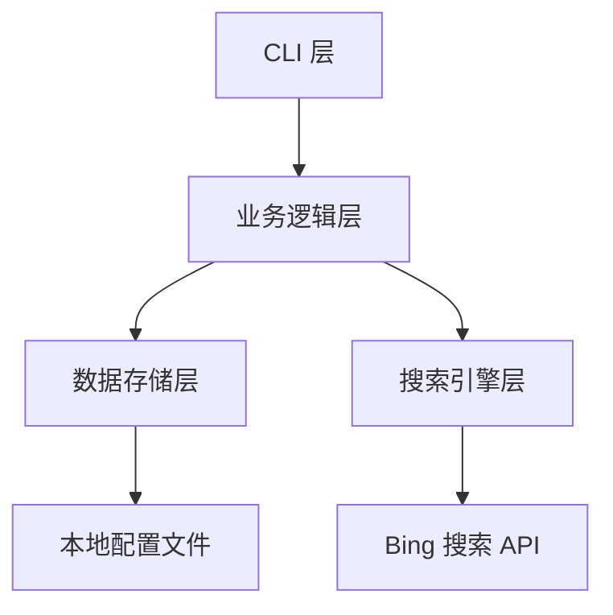
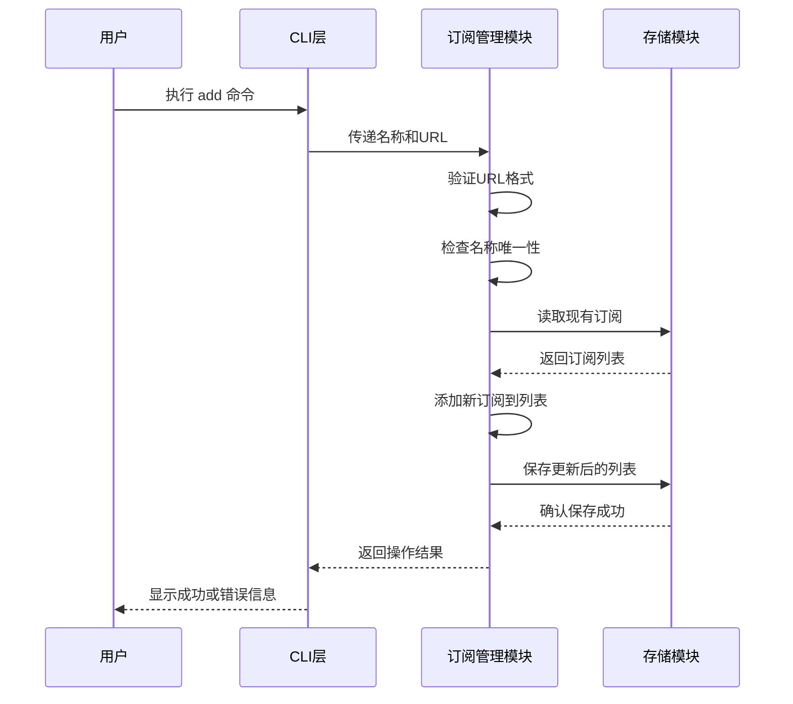
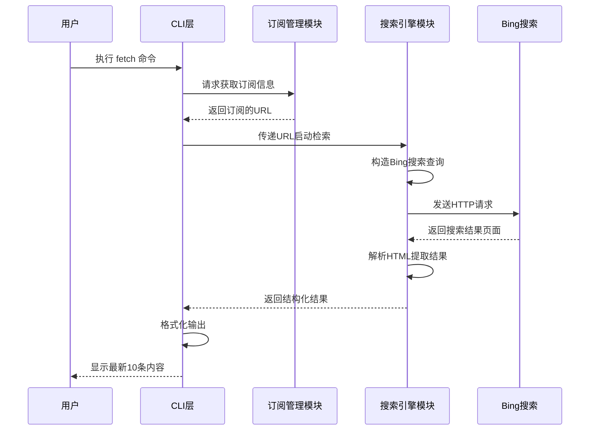
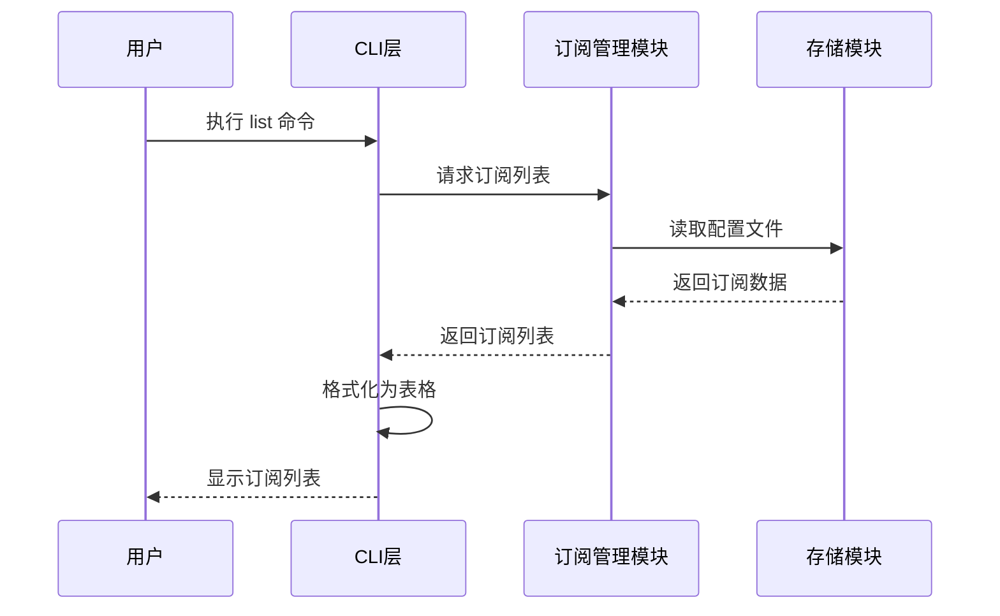
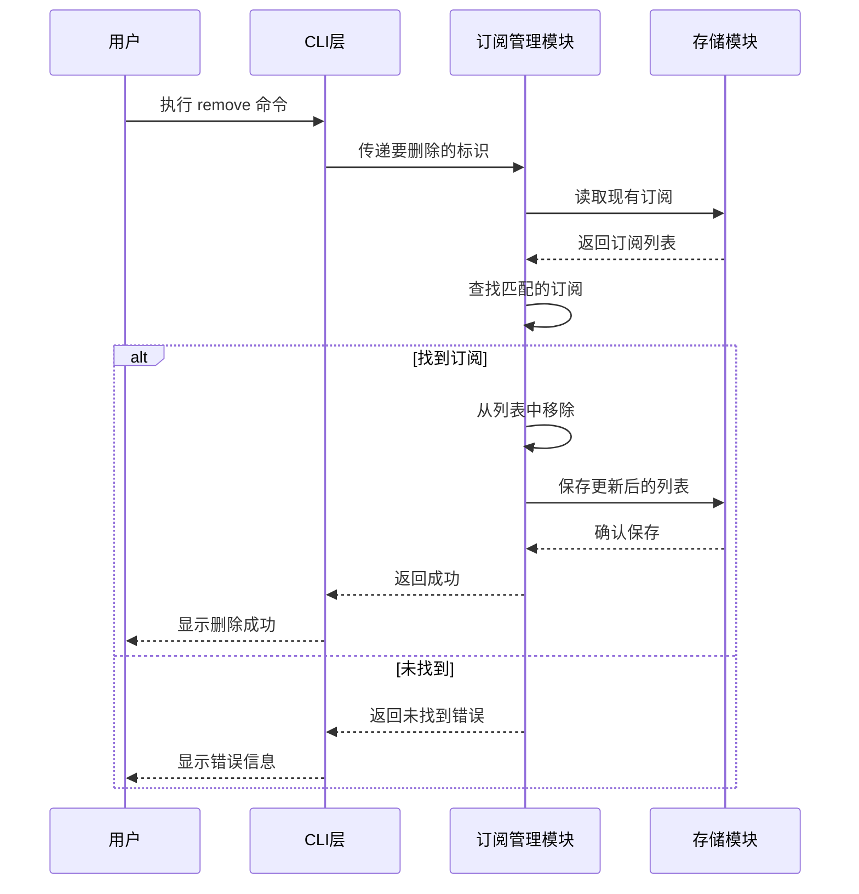

# 程序员新闻订阅 CLI 工具设计文档

## 一、项目概述

### 目标
为程序员打造一个优雅、简单、易于维护的命令行工具，用于订阅和获取技术网站的最新内容。工具通过 Bing 站内搜索功能，快速检索指定网站的最新文章，提供便捷的信息获取体验。

### 核心价值
- 简化程序员获取技术资讯的流程
- 无需打开浏览器即可快速浏览最新内容
- 支持多个技术网站的订阅管理
- 通过命令行实现高效的工作流集成

### 技术栈选择
- 开发语言：Go
- 原因：跨平台编译、单二进制文件部署、优秀的 CLI 库生态

## 二、功能需求

### 核心功能

#### 2.1 订阅管理
允许用户添加、查看、删除订阅的网站地址。

**订阅信息包含：**
| 字段 | 说明 | 必填 |
|------|------|------|
| 网站名称 | 用户自定义的订阅源名称 | 是 |
| 网站地址 | 完整的网站域名或 URL | 是 |
| 添加时间 | 订阅创建时间 | 系统自动 |

**操作类型：**
- 添加订阅：用户指定网站名称和地址
- 查看订阅列表：展示所有已订阅的网站
- 删除订阅：根据网站名称或序号删除

#### 2.2 内容检索
基于 Bing 站内搜索功能，获取订阅网站的最新内容。

**检索逻辑：**
- 使用 Bing 搜索语法：`site:域名` 按时间倒序
- 默认获取最新 10 条结果
- 解析搜索结果页面提取关键信息

**结果展示信息：**
| 字段 | 说明 |
|------|------|
| 序号 | 结果的顺序编号（1-10）|
| 标题 | 文章或页面标题 |
| URL | 文章完整链接 |
| 摘要 | 搜索结果中的描述片段 |
| 发布时间 | 如果 Bing 提供时间信息则显示 |

#### 2.3 结果输出
提供清晰、易读的命令行输出格式。

**输出要求：**
- 结构化展示：每条结果包含序号、标题、链接、摘要
- 可读性优化：使用合适的间距和分隔符
- 错误提示：网络异常、解析失败时提供明确错误信息

## 三、系统架构设计

### 3.1 整体架构

系统采用分层架构设计，职责清晰分离：



**层级说明：**
- CLI 层：处理用户命令输入和结果输出
- 业务逻辑层：订阅管理、检索流程控制
- 数据存储层：订阅数据的持久化
- 搜索引擎层：与 Bing 搜索交互、结果解析

### 3.2 核心模块

#### 订阅管理模块
**职责：**
- 订阅数据的增删查操作
- 数据验证（URL 格式、名称唯一性）
- 与存储层交互

**关键行为：**
- 添加订阅时验证 URL 格式有效性
- 确保订阅名称不重复
- 持久化存储到配置文件

#### 搜索引擎模块
**职责：**
- 构造 Bing 搜索请求
- 发送 HTTP 请求并处理响应
- 解析 HTML 页面提取结果

**关键行为：**
- 使用 `site:域名` 语法限定站内搜索
- 添加时间排序参数（如 Bing 支持）
- 解析搜索结果页面的标题、链接、摘要
- 提取最多 10 条结果
- 处理网络超时和错误响应

#### 数据存储模块
**职责：**
- 订阅数据的读写
- 文件格式管理

**存储方案：**
- 文件格式：JSON
- 存储位置：用户主目录下的配置文件夹
- 文件路径示例：`~/.news4coder/subscriptions.json`

**数据结构：**
| 字段 | 类型 | 说明 |
|------|------|------|
| subscriptions | 数组 | 订阅列表 |
| name | 字符串 | 订阅名称 |
| url | 字符串 | 网站地址 |
| created_at | 字符串 | 创建时间（ISO 8601 格式）|

#### CLI 交互模块
**职责：**
- 解析命令行参数
- 路由到对应功能
- 格式化输出结果

**命令设计：**
| 命令 | 参数 | 功能说明 |
|------|------|----------|
| add | --name, --url | 添加订阅 |
| list | 无 | 列出所有订阅 |
| remove | --name 或 --index | 删除订阅 |
| fetch | --name 或 --all | 获取最新内容 |
| help | 无 | 显示帮助信息 |

## 四、核心流程设计

### 4.1 添加订阅流程



**流程说明：**
1. 用户通过命令行输入订阅名称和 URL
2. 系统验证 URL 格式是否正确
3. 检查订阅名称是否已存在
4. 读取现有订阅配置文件
5. 将新订阅添加到列表中
6. 保存更新后的配置文件
7. 向用户反馈操作结果

**验证规则：**
- URL 必须是有效的 HTTP/HTTPS 地址
- 订阅名称不能为空且不能重复
- 订阅名称长度限制在 50 字符内

### 4.2 获取最新内容流程



**流程说明：**
1. 用户指定要获取内容的订阅源
2. 从存储中读取订阅的 URL
3. 构造 Bing 站内搜索查询字符串
4. 发送 HTTP 请求到 Bing
5. 接收并解析 HTML 响应
6. 提取标题、链接、摘要等信息
7. 格式化并输出前 10 条结果

**Bing 搜索查询构造：**
- 基本格式：`site:域名`
- 排序参数：按时间倒序（如果 Bing 支持）
- 示例：`site:infoq.cn`

**HTML 解析策略：**
- 定位搜索结果的容器元素
- 提取每条结果的标题、链接、摘要节点
- 处理缺失字段的情况
- 限制结果数量为 10 条

### 4.3 查看订阅列表流程



**输出格式：**
- 表格形式展示
- 包含序号、名称、URL、创建时间
- 空列表时提示用户添加订阅

### 4.4 删除订阅流程



**删除方式：**
- 按名称删除：精确匹配订阅名称
- 按序号删除：根据列表显示的序号

## 五、数据模型设计

### 订阅数据模型

**配置文件结构：**
| 字段 | 类型 | 必填 | 说明 |
|------|------|------|------|
| subscriptions | 数组 | 是 | 订阅列表的根节点 |

**单个订阅对象：**
| 字段 | 类型 | 必填 | 说明 | 示例 |
|------|------|------|------|------|
| name | 字符串 | 是 | 订阅源名称 | "InfoQ中文站" |
| url | 字符串 | 是 | 网站地址 | "https://www.infoq.cn" |
| created_at | 字符串 | 是 | 创建时间戳 | "2024-01-15T10:30:00Z" |

### 搜索结果数据模型

**单条搜索结果：**
| 字段 | 类型 | 必填 | 说明 |
|------|------|------|------|
| index | 整数 | 是 | 结果序号（1-10）|
| title | 字符串 | 是 | 文章标题 |
| url | 字符串 | 是 | 文章链接 |
| snippet | 字符串 | 否 | 内容摘要 |
| published_date | 字符串 | 否 | 发布时间（如果可提取）|

## 六、错误处理策略

### 错误分类与处理

#### 用户输入错误
| 错误场景 | 处理策略 |
|----------|----------|
| URL 格式无效 | 提示用户 URL 格式要求，拒绝添加 |
| 订阅名称重复 | 提示已存在同名订阅，要求使用其他名称 |
| 删除不存在的订阅 | 提示订阅不存在，显示可用订阅列表 |
| 缺少必填参数 | 显示命令帮助信息 |

#### 网络错误
| 错误场景 | 处理策略 |
|----------|----------|
| 无法连接 Bing | 提示网络连接失败，建议检查网络 |
| 请求超时 | 设置合理超时时间（如 10 秒），超时后提示用户 |
| HTTP 错误状态码 | 显示具体错误码和可能的原因 |

#### 解析错误
| 错误场景 | 处理策略 |
|----------|----------|
| HTML 结构变化导致解析失败 | 提示解析失败，记录日志便于调试 |
| 搜索结果为空 | 提示该网站暂无新内容或 Bing 未收录 |

#### 文件系统错误
| 错误场景 | 处理策略 |
|----------|----------|
| 配置文件不存在 | 首次运行时自动创建默认配置 |
| 配置文件损坏 | 提示用户文件损坏，询问是否重置 |
| 无写入权限 | 提示权限不足，建议检查文件权限 |

### 日志记录

**日志级别：**
- ERROR：记录所有错误信息
- WARN：记录潜在问题（如解析部分失败）
- INFO：记录关键操作（添加/删除订阅）

**日志存储：**
- 位置：用户配置目录下的日志文件
- 路径示例：`~/.news4coder/app.log`
- 日志轮转：文件大小超过 10MB 时自动轮转

## 七、非功能性需求

### 性能要求
- 单次搜索请求响应时间：小于 5 秒（网络正常情况下）
- 支持并发获取多个订阅源（--all 参数时）
- 配置文件读写操作在毫秒级完成

### 可维护性
- 代码结构清晰，模块职责单一
- 核心模块提供单元测试
- 使用成熟的第三方库（如 Cobra 用于 CLI，colly 或 goquery 用于 HTML 解析）
- 详细的代码注释和文档

### 可扩展性
- 预留其他搜索引擎接口的扩展可能
- 订阅模型支持未来添加更多字段（如优先级、分类标签）
- 输出格式可扩展（如 JSON 输出用于脚本集成）

### 用户体验
- 简洁的命令语法，符合 Unix 哲学
- 清晰的错误提示和帮助信息
- 支持命令自动补全（可选）
- 输出内容适配终端宽度，避免错位

### 跨平台兼容性
- 支持 Windows、macOS、Linux
- 配置文件路径根据操作系统自适应
- 使用 Go 标准库保证跨平台特性

## 八、技术选型建议

### Go 库推荐

| 功能模块 | 推荐库 | 选择理由 |
|----------|--------|----------|
| CLI 框架 | Cobra | 功能强大，社区活跃，支持子命令和参数解析 |
| HTML 解析 | goquery | 类 jQuery 语法，易于使用 |
| HTTP 客户端 | 标准库 net/http | 功能足够，无需额外依赖 |
| 配置文件处理 | 标准库 encoding/json | JSON 格式简单清晰 |
| 彩色输出 | fatih/color | 增强终端输出可读性 |

### 目录结构建议

```
news4coder/
├── cmd/                    # 命令行入口
│   └── root.go            # 根命令和子命令定义
├── internal/              # 内部模块
│   ├── subscription/      # 订阅管理模块
│   ├── search/           # 搜索引擎模块
│   └── storage/          # 存储模块
├── pkg/                   # 可导出的公共包（如有）
├── main.go               # 程序入口
├── go.mod                # 依赖管理
└── README.md             # 项目说明
```

## 九、命令行交互示例

### 添加订阅
**命令：** `news4coder add --name "InfoQ中文站" --url "https://www.infoq.cn"`

**成功输出：**
```
✓ 成功添加订阅：InfoQ中文站
  URL: https://www.infoq.cn
```

### 查看订阅列表
**命令：** `news4coder list`

**输出示例：**
```
订阅列表：
序号  名称          URL                        创建时间
1    InfoQ中文站   https://www.infoq.cn       2024-01-15 10:30
2    Hacker News   https://news.ycombinator.com 2024-01-16 14:20
```

### 获取最新内容
**命令：** `news4coder fetch --name "InfoQ中文站"`

**输出示例：**
```
正在获取 InfoQ中文站 的最新内容...

1. Go 1.22 版本新特性解析
   https://www.infoq.cn/article/go-1.22-features
   本文详细介绍了 Go 1.22 的新特性，包括泛型改进、性能优化等...

2. 微服务架构下的分布式事务实践
   https://www.infoq.cn/article/distributed-transaction
   探讨在微服务架构中如何处理分布式事务的一致性问题...

[... 共 10 条结果]
```

### 删除订阅
**命令：** `news4coder remove --name "InfoQ中文站"`

**成功输出：**
```
✓ 已删除订阅：InfoQ中文站
```

## 十、实施优先级

### 第一阶段（MVP 核心功能）
1. 订阅管理基础功能（添加、查看、删除）
2. 本地 JSON 文件存储
3. 基础 CLI 命令框架
4. Bing 搜索集成和结果解析
5. 简单的终端输出

### 第二阶段（体验优化）
1. 错误处理完善
2. 彩色输出和格式美化
3. 日志记录功能
4. 配置文件自动创建和恢复

### 第三阶段（扩展功能）
1. 支持 --all 参数批量获取
2. JSON 输出格式（用于脚本集成）
3. 搜索结果缓存机制
4. 命令自动补全

## 十一、风险与挑战

### Bing 搜索依赖风险
**风险描述：** Bing 搜索结果页面 HTML 结构可能变化，导致解析失败

**应对策略：**
- 使用灵活的 CSS 选择器，降低对精确结构的依赖
- 实现多层次回退解析策略
- 记录解析失败的详细日志，便于快速修复
- 预留其他搜索引擎适配接口

### 搜索结果质量
**挑战描述：** Bing 站内搜索可能无法准确按时间排序，或某些网站收录不及时

**应对策略：**
- 在输出中明确标注"基于 Bing 搜索结果"
- 未来可考虑直接解析网站 RSS/Sitemap 作为补充方案
- 提供用户反馈机制

### 网络稳定性
**挑战描述：** 用户网络环境不稳定或 Bing 服务不可达

**应对策略：**
- 设置合理的超时和重试机制
- 提供离线模式（显示上次缓存结果）
- 清晰的错误提示和网络诊断建议
